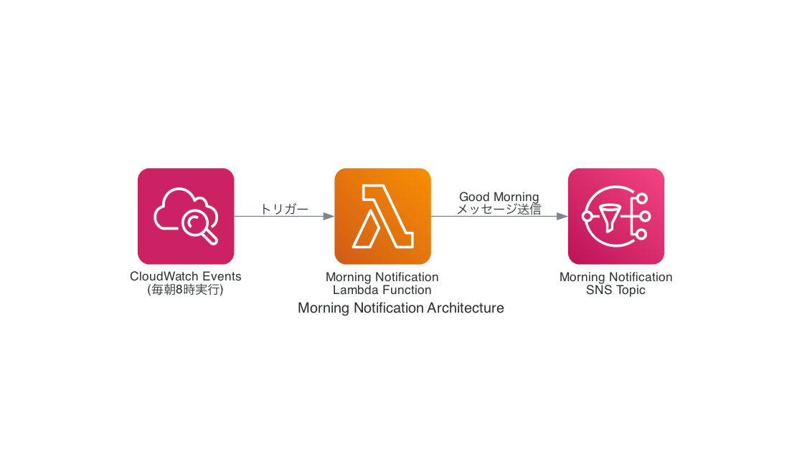

# Morning Notification

このプロジェクトは、AWS CDKを使用して、毎朝8時（日本時間）に「Good Morning」というメッセージをSNSトピックに送信するシステムを構築します。

## アーキテクチャ



このシステムは以下のAWSサービスを使用しています：

- [AWS CloudWatch Events](https://docs.aws.amazon.com/AmazonCloudWatch/latest/events/WhatIsCloudWatchEvents.html) - スケジュールに基づいてLambda関数をトリガーします
- [AWS Lambda](https://docs.aws.amazon.com/lambda/latest/dg/welcome.html) - SNSトピックにメッセージを送信するコードを実行します
- [Amazon SNS](https://docs.aws.amazon.com/sns/latest/dg/welcome.html) - メッセージを配信するためのパブリッシュ/サブスクライブシステムを提供します

## デプロイ方法

このプロジェクトをデプロイするには、以下のコマンドを実行します：

```bash
# AWSプロファイルを設定（必要な場合）
export AWS_PROFILE=your-profile-name

# CDKをブートストラップ（初回のみ）
npx cdk bootstrap

# スタックをデプロイ
npx cdk deploy
```

## 開発方法

このプロジェクトは、TypeScriptで記述されたAWS CDKアプリケーションです。

```bash
# 依存関係をインストール
npm install

# コードをビルド
npm run build

# テスト
npm test

# CDKスタックの合成
npm run cdk synth
```

## カスタマイズ

- メッセージの内容を変更するには、`lambda/index.js`ファイルの`Message`パラメータを編集します
- 実行時間を変更するには、`lib/morning-notification-stack.ts`ファイルのCloudWatchイベントルールのスケジュール設定を編集します
